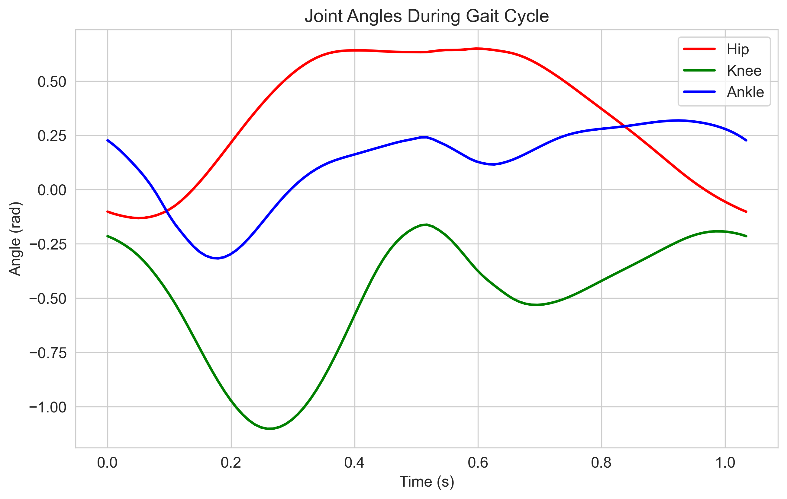
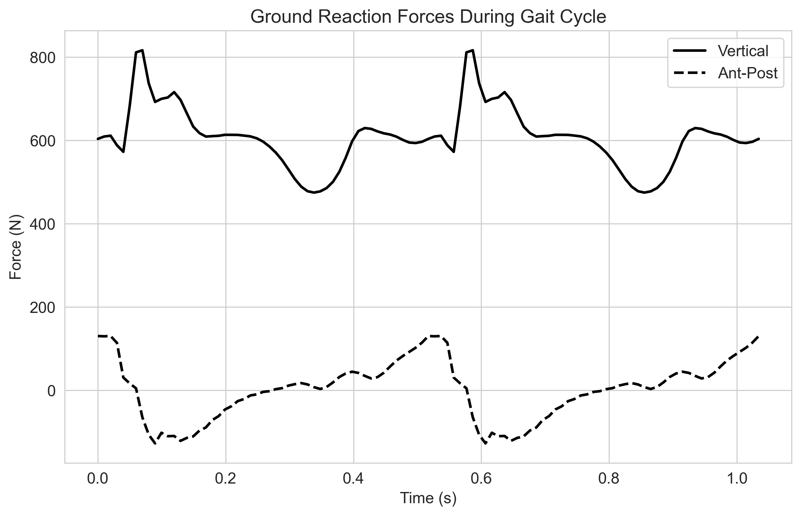
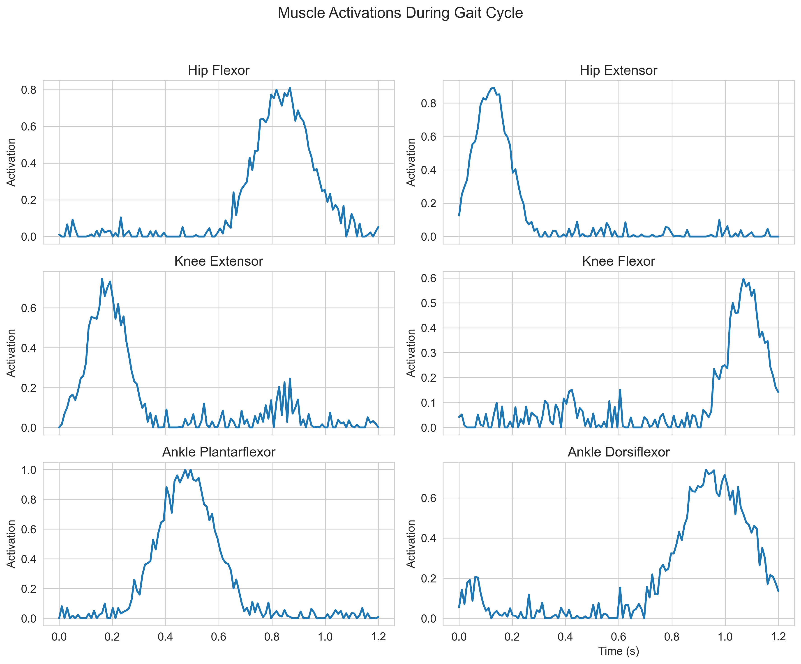

# 🚶‍♂️ GaitSim Assist: A Python Library for Gait Simulations and Assistive Device Design

GaitSim Assist is a comprehensive Python library for biomechanics researchers and wearable device engineers. It provides a high-level API for running gait simulations, testing assistive device parameters, and optimizing cost function settings without deep diving into low-level OpenSim code.

## 🌟 Features

- **Unified Gait Simulation API**: High-level Python APIs to load gait datasets, run simulations (tracking or predictive), and retrieve joint kinematics & kinetics results.
- **Cost Function Modules**: Built-in library of cost functions (metabolic cost, fatigue, effort, etc.) that can be swapped or combined to see how assistive outcomes change.
- **Assistive Device Modeling**: Tools to model simple assistive device effects (like exoskeleton torques or prosthetic joint limits) and incorporate them into simulations.
- **Visualization & Analysis**: Automatic generation of gait plots – joint angle curves, ground reaction forces, muscle activations – for both experimental and synthetic gait data.

## 📋 Installation

### Using pip

```bash
pip install gaitsim-assist
```

### From source

```bash
git clone https://github.com/yourusername/gaitsim-assist.git
cd gaitsim-assist
pip install -e .
```

### Dependencies

GaitSim Assist requires:
- Python 3.9+
- OpenSim 4.3+
- NumPy, Matplotlib, Pandas, SciPy
- CasADi (for optimization)

## 🚀 Quick Start

### Basic Simulation

```python
import gaitsim_assist as gsa

# Create a simulator with default 2D walking model
simulator = gsa.GaitSimulator()

# Run a predictive simulation with cost of transport cost function
results = simulator.run_predictive_simulation(
    cost_function='cot',
    time_range=(0.0, 1.0)
)

# Visualize the results
from gaitsim_assist.visualization import GaitPlotter
plotter = GaitPlotter()
plotter.plot_joint_angles(results)
plotter.plot_ground_forces(results)
```

### Example Scripts

We provide several example scripts in the `examples/` directory:

- **basic_simulation_moco.py**: Run a simple walking simulation using OpenSim Moco
- **compare_cost_functions.py**: Compare different cost functions (muscle effort, joint torque, hybrid)
- **analyze_opensim_results.py**: Analyze and visualize existing OpenSim simulation results
- **batch_processing.py**: Run multiple simulations with different parameters
- **assistive_device_optimization.py**: Optimize assistive device parameters
- **custom_cost_function.py**: Create and use custom cost functions

To run an example:

```bash
cd examples
python basic_simulation_moco.py
```

### Adding an Assistive Device

```python
# Create an ankle exoskeleton
exo = gsa.devices.Exoskeleton(
    name="ankle_exo",
    model=simulator.model,
    joint_name="ankle",
    mass=1.0,
    max_torque=50.0
)

# Run simulation with the exoskeleton
exo_results = simulator.run_predictive_simulation(
    cost_function='cot',
    time_range=(0.0, 1.0),
    assistive_device=exo
)
```

### Comparing Different Cost Functions

```python
# Create a hybrid cost function
hybrid_cost = gsa.cost_functions.Hybrid(
    simulator.model,
    cost_functions={
        'cot': 0.5,
        'muscle_effort': 0.5
    }
)

# Run simulation with the hybrid cost function
hybrid_results = simulator.run_predictive_simulation(
    cost_function=hybrid_cost,
    time_range=(0.0, 1.0)
)

# Compare results
plotter.compare_simulations(
    results_list=[results, exo_results, hybrid_results],
    labels=["Baseline", "Exoskeleton", "Hybrid Cost"],
    plot_type="joint_angles"
)
```

## 📊 Example Visualizations

### Joint Angles

*Detailed view of joint angles for hip, knee, and ankle joints throughout the gait cycle.*

### Ground Reaction Forces

*Ground reaction forces showing both vertical and anterior-posterior components during walking.*

### Muscle Activations

*Muscle activation patterns during the gait cycle, showing the timing and magnitude of major muscle group activations during walking.*

## 📚 Documentation

For full documentation, visit [docs.gaitsim-assist.org](https://docs.gaitsim-assist.org).

### Tutorials

- [Getting Started](https://docs.gaitsim-assist.org/tutorials/getting_started.html)
- [Creating Custom Cost Functions](https://docs.gaitsim-assist.org/tutorials/custom_cost_functions.html)
- [Modeling Assistive Devices](https://docs.gaitsim-assist.org/tutorials/assistive_devices.html)
- [Analyzing Simulation Results](https://docs.gaitsim-assist.org/tutorials/analysis.html)

## 🛠 Project Structure

```
gaitsim_assist/
├── __init__.py
├── simulation/           # Core simulation capabilities
│   ├── __init__.py
│   ├── gait_simulator.py
│   ├── tracking.py
│   └── predictive.py
├── cost_functions/       # Cost function implementations
│   ├── __init__.py
│   ├── base.py
│   ├── cot.py
│   ├── muscle_effort.py
│   └── ...
├── devices/              # Assistive device models
│   ├── __init__.py
│   ├── base.py
│   ├── exoskeleton.py
│   └── ...
├── visualization/        # Visualization tools
│   ├── __init__.py
│   ├── gait_plotter.py
│   └── ...
└── analysis/             # Analysis tools
    ├── __init__.py
    └── ...
```

## 🤝 Contributing

Contributions are welcome! Please feel free to submit a Pull Request. For major changes, please open an issue first to discuss what you would like to change.

## 📄 License

This project is licensed under the MIT License - see the LICENSE file for details.

## 🙏 Acknowledgments

- OpenSim community for their excellent tools and documentation
- Contributors to the biomechanics research community
