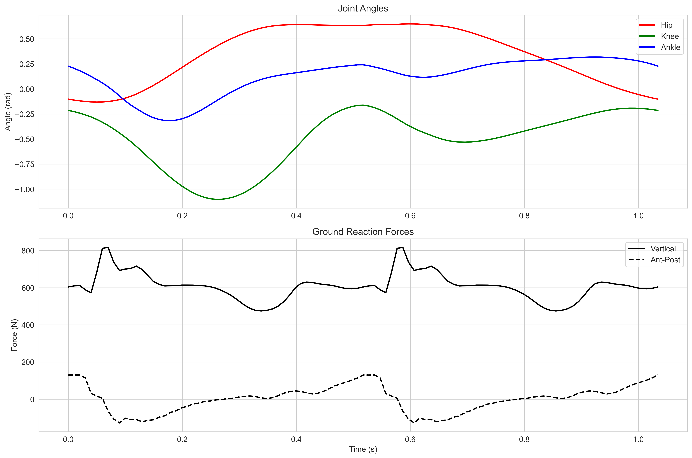
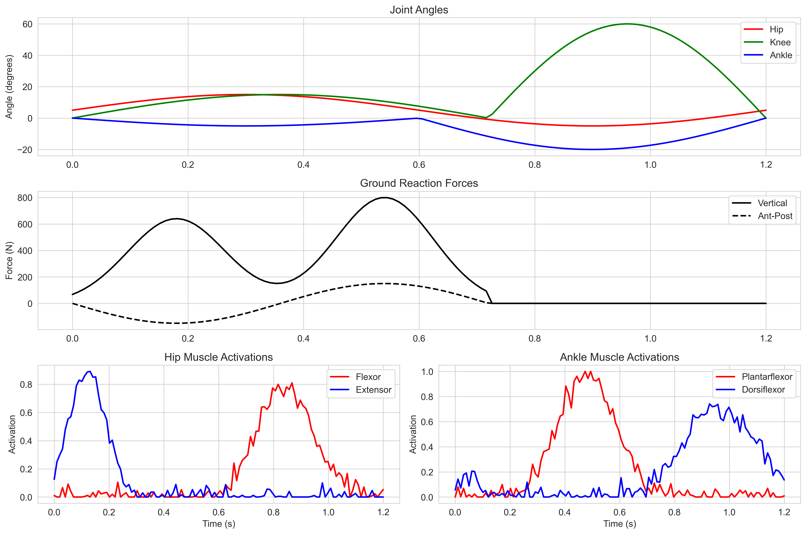

# 🚶‍♂️ Assistive Device Design: 2D Walking Simulation & Analysis

This repository contains a comprehensive framework for analyzing and simulating human gait, with applications in assistive device design. The project combines experimental gait analysis, synthetic gait generation, and comparative analysis tools to provide insights into human locomotion patterns.

## 📋 Project Components

### 1. Experimental Gait Analysis (`sims/experimental_gait_analysis.py`)
- Processes and analyzes experimental gait data from OpenSim tracking files
- Extracts joint angles (hip, knee, ankle) and ground reaction forces
- Generates detailed visualizations of gait parameters
- Supports both raw time series and normalized gait cycle analysis

### 2. Synthetic Gait Generation (`sims/synthetic_gait.py`)
- Generates biomechanically realistic gait patterns
- Produces joint kinematics and ground reaction forces
- Implements physiologically accurate timing of gait phases
- Creates smooth, continuous motion patterns

### 3. Comparative Analysis (`sims/compare_gait_analyses.py`)
- Compares experimental and synthetic gait data
- Provides quantitative metrics for evaluation
- Generates side-by-side visualizations
- Supports time-normalized comparisons

## 📊 Generated Visualizations

### Experimental Data Analysis

*Comprehensive visualization of experimental gait data showing joint angles and ground reaction forces over time. The plots display hip, knee, and ankle joint angles (top three panels) and ground reaction forces (bottom panel) during a complete gait cycle.*


*Detailed view of experimental joint angles for hip, knee, and ankle joints. Each curve represents the angular motion of the respective joint throughout the gait cycle, providing insights into joint coordination patterns.*


*Ground reaction forces from experimental data showing both vertical and anterior-posterior components. These forces represent the interaction between the foot and the ground during walking.*

### Comparative Analysis

*Side-by-side comparison of experimental and synthetic gait data. This visualization allows direct comparison of joint kinematics and ground reaction forces between the experimental measurements and our synthetic model predictions.*

### Additional Analyses

*Muscle activation patterns during the gait cycle, showing the timing and magnitude of major muscle group activations during walking.*

## 🛠 Installation & Setup

1. Clone the repository:
```bash
git clone https://github.com/yourusername/Assistive-Device-Design.git
cd Assistive-Device-Design
```

2. Install dependencies:
```bash
pip install -r requirements.txt
```

## 📈 Usage

### Running Experimental Analysis
```python
from sims.experimental_gait_analysis import ExperimentalGaitAnalyzer

analyzer = ExperimentalGaitAnalyzer()
analyzer.load_data('path/to/grf_file.sto', 'path/to/state_file.sto')
analyzer.plot_results()
```

### Generating Synthetic Data
```python
from sims.synthetic_gait import SyntheticGaitGenerator

generator = SyntheticGaitGenerator()
synthetic_data = generator.generate_complete_gait_dataset()
```

### Comparing Data
```python
from sims.compare_gait_analyses import GaitAnalysisComparator

comparator = GaitAnalysisComparator()
comparator.load_experimental_data()
comparator.generate_synthetic_data()
comparator.plot_comparison()
```

## 📚 Data Structure

The repository is organized as follows:
```
.
├── sims/                      # Simulation and analysis scripts
│   ├── experimental_gait_analysis.py
│   ├── synthetic_gait.py
│   └── compare_gait_analyses.py
├── results/                   # Generated visualizations and data
│   ├── experimental_*.png     # Experimental analysis plots
│   ├── synthetic_*.png       # Synthetic data plots
│   └── comparison_*.png      # Comparative analysis plots
├── data/                      # Raw data directory
│   └── cost_function_sensitivity_results/
└── requirements.txt           # Project dependencies
```

## 🤝 Contributing

Contributions are welcome! Please feel free to submit a Pull Request. For major changes, please open an issue first to discuss what you would like to change.

## 📄 License

This project is licensed under the MIT License - see the LICENSE file for details.

## 🙏 Acknowledgments

- OpenSim community for their excellent tools and documentation
- Contributors to the biomechanics research community
- Original authors of the cost function sensitivity analysis study
